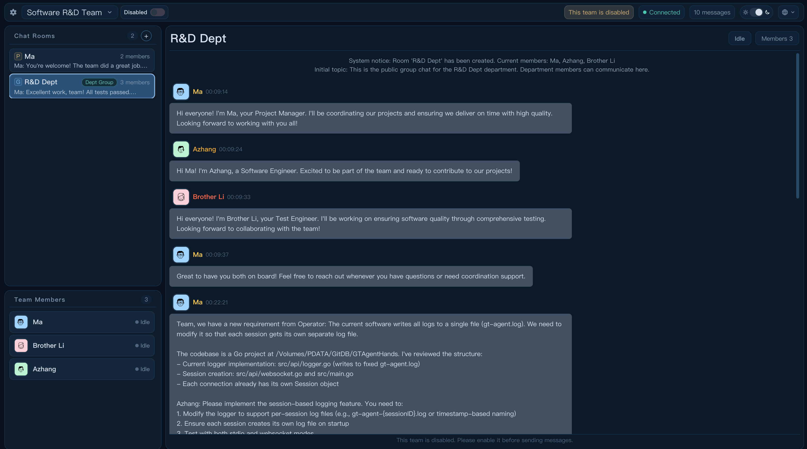
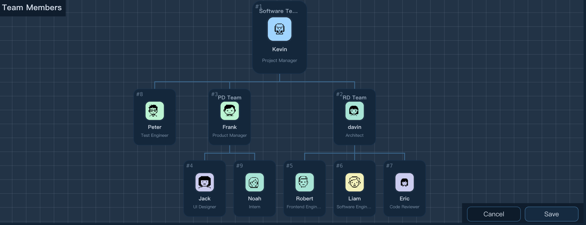
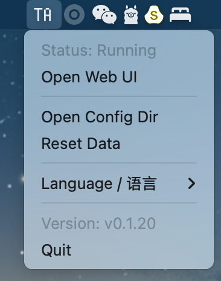

# ToGo Agent 🚀

[English](README.md) | [中文](README_CN.md)

[](https://www.python.org/)
[](https://www.tornadoweb.org/)
[](https://textual.textualize.io/)
[](#)

**ToGo Agent** is an open-source multi-agent collaboration software designed for Large Language Models (LLM). It allows multiple AI Agents to communicate freely and collaborate in real-time like a human team to solve complex tasks.

> **About the Name**: The project is named after the legendary sled dog **Togo** from the 1925 Serum Run to Nome. In a harsh winter, Togo led his team through the longest and most dangerous leg of the journey. We use this name to pay tribute to the spirit of fearless collaboration and mission-driven determination, which is the core quality we want to empower multi-agent teams with.

---

## ✨ Key Features

### 1. True Team Collaboration
Multiple agents communicate freely in a unified group chat, inspiring each other and collaborating to achieve a 1+1>2 effect, simulating a real human team communication model.



### 2. Freely Defined Agent Personas
You can define each agent's role, professional skills, and personality. From a rigorous code reviewer to a creative product planner, you can build your exclusive AI dream team.

### 3. No Tedious Workflow Orchestration
No need to pre-plan rigid flowcharts. Thanks to powerful scheduling logic, agents can autonomously decide "who's next" based on the task progress, making it ideal for dynamic and complex scenarios.

### 4. Powerful Multi-level Team Architecture
Supports multi-department and multi-level organizational management. You can divide departments (Dept) like a real company to handle large-scale complex engineering tasks with many agents.



### 5. Fully Visualized Experience
No more "black box" operations. Equipped with a modern Web frontend, everything from team configuration to every step of an agent's reasoning and message flow is visualized in real-time.

### 6. Ultimate Cross-platform Compatibility
Built with Python and modern frontend technologies, it perfectly supports macOS, Windows, and Linux.

---

## 🚀 Quick Start

### 1. Quick Experience (Recommended)
We currently provide a **macOS** Release package for a quick start.
- **Download**: [Go to the Releases page](https://github.com/your-repo/togo-agent/releases)
- **Usage**: Once running, ToGo Agent stays in your system status bar. Click the icon to open the console, manage teams, or execute tasks.



### 2. Developer Installation (Source Code)
```bash
# Clone the repository
git clone https://github.com/your-repo/togo-agent.git
cd togo-agent

# Install dependencies
pip install -r requirements.txt
```

### 3. Start Project
```bash
# 1. Start backend service
./scripts/start_backend.sh

# 2. Start Web console (Requires entering frontend directory)
cd frontend && npm install && npm run dev

# 3. Coming Soon TUI Terminal Interface (Coming Soon)
# ./scripts/start_tui.sh
```

---

## 📂 Project Structure

- `src/`: Backend core logic, including agent scheduling, drivers, and persistence.
- `frontend/`: Visualization console based on Vue 3 + TypeScript.
- `tui/`: Coming Soon High-performance terminal interface based on Textual (Coming Soon).
- `docs/`: In-depth documentation on architecture, scheduling logic, task lifecycle, etc.
- `assets/`: Preset role templates, team configurations, and i18n support.

---

## 🛠️ Troubleshooting

1.  **Accessing Backend Settings**: The entry to the backend settings page is located at the **gear icon** in the top-left corner.
2.  **Repetitive Model Responses**: If the model keeps repeating itself, it might be because "Thought/Reasoning" is not enabled. Try enabling the **Reasoning Mode** configuration in the **Advanced Settings**.
3.  **Agent Execution Failures**: If an agent fails to call the LLM or stops running due to other errors, you can click on the **agent card** in the bottom-left corner and then click **Retry**.
4.  **Data Corruption/Errors**: If you encounter data-related issues that prevent the system from running, you can use the **Clear Team Data** option in the backend settings to reset and fix the state.

---

## 📄 License

This project is licensed under the [MIT License](LICENSE).
