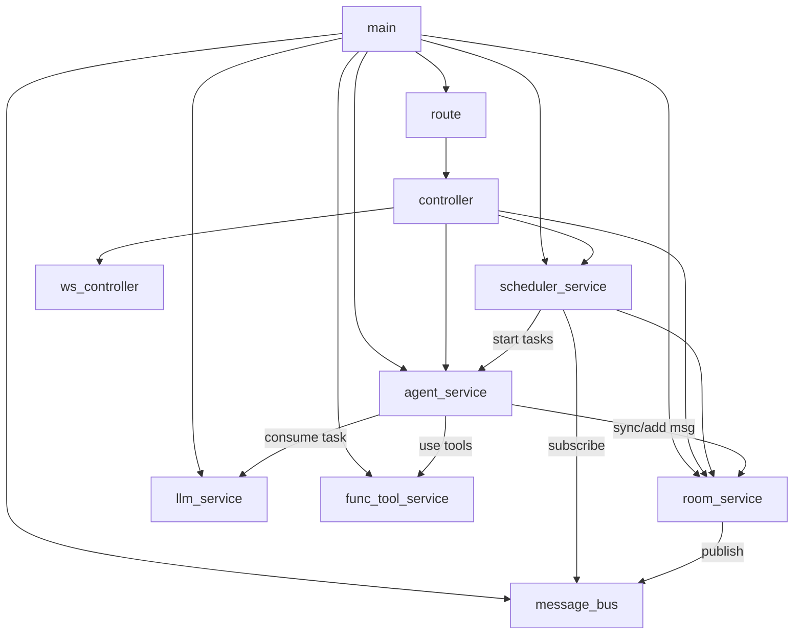

# Service 依赖关系图



## 说明

| 模块层级 | 角色 | 依赖 |
|---------|------|------|
| `main` | 程序入口，按序初始化所有服务，启动 Tornado 与全局调度器 | route / agent_service / room_service / scheduler_service |
| `route / controller` | Web API 层，处理 HTTP 请求与 WebSocket 推送，查询 Agent/Room 状态 | agent_service / room_service / scheduler_service |
| `scheduler_service` | 任务生命周期管理，监听轮次事件并激活 Agent 内部任务协程 | agent_service (Agent.consume_task) / message_bus |
| `agent_service` | **[自治核心]** 维护 Agent 实例及其任务队列，执行对话轮次与 Tool 调用，自主维护活跃状态 | llm_service / room_service / func_tool_service |
| `room_service` | 管理聊天室状态、成员名单、严格轮次推进逻辑 | message_bus |
| `llm_service` | 封装大模型 API 调用（OpenAI 兼容协议） | 无 |
| `func_tool_service` | 提供工具注册、加载与执行环境 | 无 |
| `message_bus` | 轻量级异步事件总线，负责组件间解耦通信 | 无 |
```
