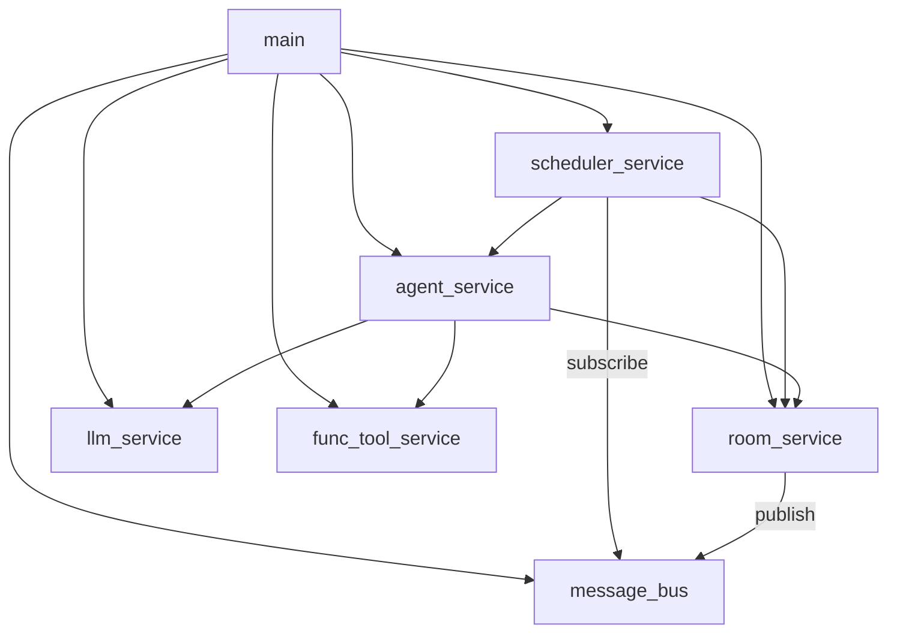

# Service 依赖关系图



## 说明

| Service | 角色 | 依赖 |
|---------|------|------|
| `scheduler_service` | 顶层调度，驱动所有 Agent 轮次 | agent_service / room_service / message_bus |
| `agent_service` | 管理 Agent 实例，执行一轮发言（含 tool call 循环） | llm_service / room_service / func_tool_service |
| `room_service` | 管理聊天室和轮次状态 | message_bus |
| `llm_service` | 封装 LLM API 调用 | 无 |
| `func_tool_service` | 管理和执行工具函数 | 无 |
| `message_bus` | 发布/订阅事件总线 | 无 |
```
