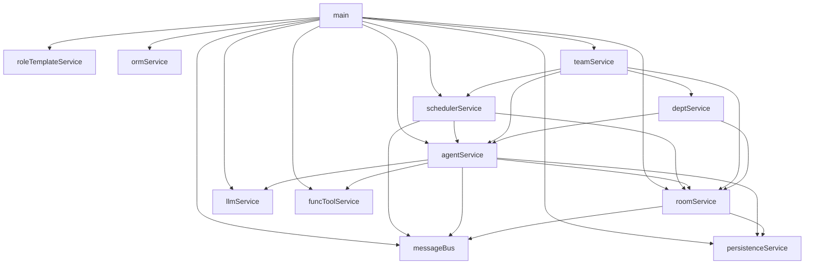

# Service 依赖关系图

## 说明

| 模块 | 角色 | 依赖 |
|------|------|------|
| `main` | 程序入口，按序初始化所有服务，启动 Tornado 与全局调度器 | roleTemplateService / agentService / roomService / schedulerService / llmService / funcToolService / messageBus / persistenceService / ormService / teamService |
| `schedulerService` | 任务生命周期管理，监听轮次事件并激活 Agent 内部任务协程 | agentService / roomService / messageBus |
| `roleTemplateService` | 角色模板导入服务，启动时将 `AppConfig.role_templates` 写入数据库 | 无 |
| `agentService` | **[自治核心]** 维护 Agent 实例及其任务队列，执行对话轮次与 Tool 调用，自主维护活跃状态 | llmService / roomService / funcToolService / persistenceService / messageBus |
| `roomService` | 管理聊天室状态、成员名单、严格轮次推进逻辑 | messageBus / persistenceService |
| `teamService` | Team/Room 配置管理与热更新，导入配置并编排运行态重载 | deptService / agentService / roomService / schedulerService |
| `deptService` | 部门树与成员归属管理，同步创建/更新部门房间并维护成员列表（V10） | roomService / agentService |
| `persistenceService` | 纯 DAL 门面，封装消息历史与房间运行时状态的读写；不依赖其他 service | 无 |
| `llmService` | 封装大模型 API 调用（OpenAI 兼容协议） | 无 |
| `funcToolService` | 提供工具注册、加载与执行环境 | 无 |
| `messageBus` | 轻量级异步事件总线，负责组件间解耦通信；在事件循环中 `publish` 采用异步调度，避免慢订阅者阻塞发布链路 | 无 |
| `ormService` | SQLite 数据库连接管理，提供异步 ORM 初始化与 schema 迁移 | 无 |