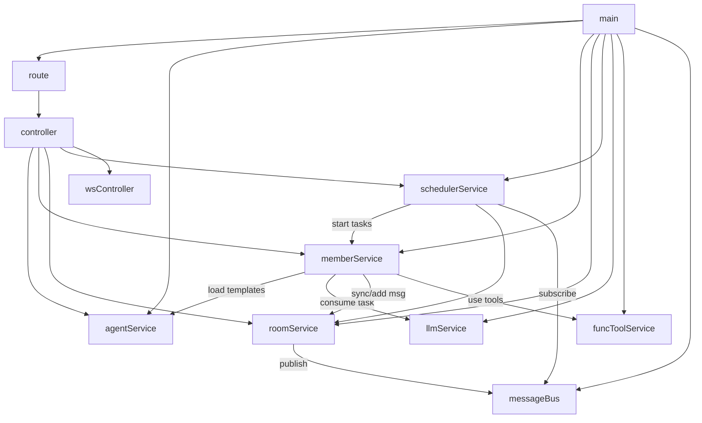

# Service 依赖关系图

## 说明

| 模块层级 | 角色 | 依赖 |
|---------|------|------|
| `main` | 程序入口，按序初始化所有服务，启动 Tornado 与全局调度器 | route / agentService / memberService / roomService / schedulerService |
| `route / controller` | Web API 层，处理 HTTP 请求与 WebSocket 推送，查询 Agent/Room 状态 | agentService / memberService / roomService / schedulerService |
| `schedulerService` | 任务生命周期管理，监听轮次事件并激活 TeamMember 内部任务协程 | memberService (TeamMember.consume_task) / messageBus |
| `agentService` | Agent 模版配置管理，维护 AgentTemplate 定义与 prompt 加载 | 无 |
| `memberService` | **[自治核心]** 维护 TeamMember 实例及其任务队列，执行对话轮次与 Tool 调用，自主维护活跃状态 | agentService / llmService / roomService / funcToolService |
| `roomService` | 管理聊天室状态、成员名单、严格轮次推进逻辑 | messageBus |
| `llmService` | 封装大模型 API 调用（OpenAI 兼容协议） | 无 |
| `funcToolService` | 提供工具注册、加载与执行环境 | 无 |
| `messageBus` | 轻量级异步事件总线，负责组件间解耦通信；在事件循环中 `publish` 采用异步调度，避免慢订阅者阻塞发布链路 | 无 |
