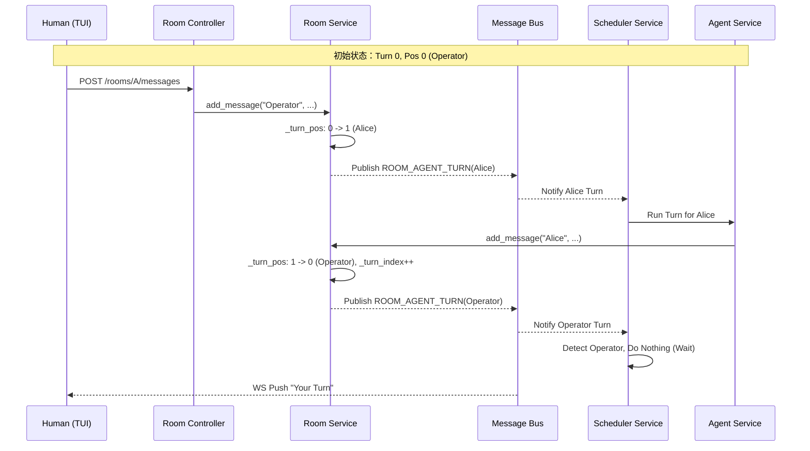

# V6: 交互式协作 (交互简化版) 技术文档

## 1. 架构概览
V6 版本通过将人类（Operator）引入统一的轮次调度模型，实现 1-on-1 的人机交互。

### 1.1 关键设计原则
- **统一模型**：人类操作者（使用 `SpecialAgent.OPERATOR` 身份）在逻辑上被视为房间的一名成员，参与 `_turn_index` 的循环。
- **类型隔离**：通过 `RoomType` 枚举区分单聊与群聊，确保逻辑清晰。
- **混合驱动**：人类回合由外部 HTTP 驱动，Agent 回合由内部事件总线驱动。

## 2. 接口定义

### 2.1 获取房间列表 (扩展)
`GET /rooms`
- **新增字段**：`room_type` (`"private"` | `"group"`)，对应后端 `RoomType` 枚举值。
- **Private 房间特征**：`members` 列表首位通常为 `SpecialAgent.OPERATOR` ("Operator")。


### 2.2 发送人类消息
`POST /rooms/{room_name}/messages`
- **处理流程**：
    1. 验证当前房间是否确实轮到 "Operator"（可选，为简化起见可允许随时插话）。
    2. 调用 `room_service.get_room(room_name).add_message("Operator", content)`。
    3. 现有代码会自动发布 `ROOM_AGENT_TURN(agent_name="Alice")` 从而驱动 Agent。

## 3. 核心逻辑实现

### 3.1 房间模型调整 (`room_service.py`)
- `ChatRoom` 类增加 `self.room_type` 属性。
- **初始化调整**：`setup_turns` 接收的 `agent_names` 列表在 Private 模式下包含 "Operator"。
  - 例：`room.setup_turns(["Operator", "Alice"], max_turns=50)`。

### 3.2 调度器逻辑统一 (`scheduler_service.py`)
- **事件过滤**：在 `_on_agent_turn` 中，增加对 "Operator" 的特殊处理。
  ```python
  def _on_agent_turn(msg: Message) -> None:
      agent_name = msg.payload["agent_name"]
      if agent_name == "Operator":
          logger.info(f"轮到人类操作者，系统进入等待状态: room={msg.payload['room_name']}")
          return  # 不创建异步任务，不激活 AI
      # ... 现有 AI 激活逻辑 ...
  ```

### 3.3 Agent Service 适配 (`agent_service.py`)
- **配置扩展**：支持在 `rooms_config` 中指定包含 "Operator" 的成员列表。
- **Prompt 增强**：在为 Private 房间生成 System Prompt 时，明确告知 Agent 正在与人类对话。

## 4. TUI 与前端交互
- **状态感知**：TUI 通过 WebSocket 监听 `ROOM_AGENT_TURN` 事件。
- **UI 反馈**：
    - 若收到 `agent_name == "Operator"`，激活输入框并显示“轮到你了”。
    - 若收到 `agent_name == "Alice"`，禁用输入框并显示“Alice 正在思考...”。

## 5. 序列图 (统一轮次模型)

