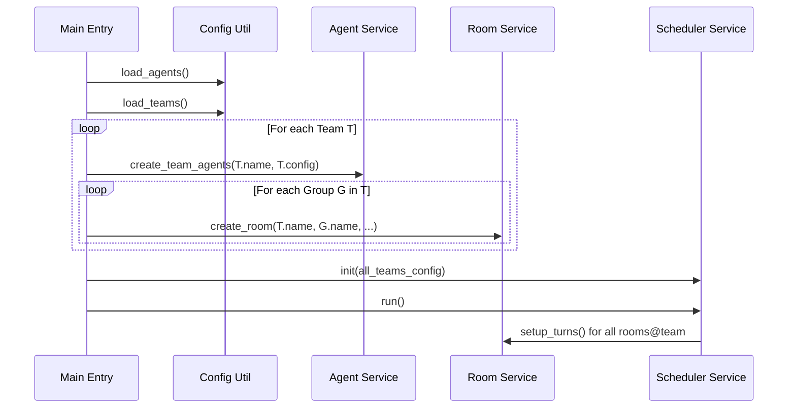

# V7: 团队化组织与多租户隔离 - 技术文档

## 1. 架构概览
V7 版本通过引入 "Team" 作为资源管理和调度的顶层命名空间，实现了从单租户到多租户架构的演进。

### 1.1 核心设计原则
- **命名空间隔离 (Namespacing)**：通过 `name@team` 格式统一标识 Agent 和 Room，将物理上的单实例映射到逻辑上的多租户空间。
- **全局实例管理**：Agent 和 Room 的实例池不再是简单的扁平结构，而是基于团队标识进行索引。
- **配置驱动初始化**：系统启动时自动扫描 `config/teams/` 目录，按团队定义动态构建运行环境。

## 2. 命名空间与资源标识

### 2.1 Agent 标识
- **格式**：`agent_name@team_name` (例如 `alice@customer_service`)
- **实现**：`agent_service._make_agent_key(team_name, agent_name)`
- **隔离性**：即使 `agent_name` 相同，不同团队的 Agent 也是独立的 Python 实例，拥有独立的 `_history`。

### 2.2 Room 标识
- **格式**：`room_name@team_name` (例如 `support@customer_service`)
- **实现**：`room_service._make_room_key(team_name, room_name)`
- **隔离性**：不同团队的同名房间数据完全独立。

## 3. 核心模块实现

### 3.1 系统初始化 (`main.py`)
初始化流程重构为按团队迭代：
1. **加载定义**：调用 `load_agents()` 加载所有通用的 Agent 配置定义。
2. **加载团队**：调用 `load_teams()` 扫描并加载所有团队 JSON。
3. **团队循环**：
   - 针对每个团队，调用 `agent_service.create_team_agents()` 创建该团队所需的 Agent 实例。
   - 针对团队中的每个 Group/Room，调用 `chat_room.create_room()` 创建房间实例。
4. **启动调度**：将所有团队配置传递给 `scheduler.init()`。

### 3.2 代理服务 (`agent_service.py`)
- **实例池**：`_agents` 字典以 `agent_key` 为键。
- **跨房间共享**：在同一团队内，同一个 `Agent` 实例可以被多个 `ChatRoom` 引用。由于 `Agent` 内部维护了 `_history`，这为 V3.1 提出的跨房间感知提供了底层支持。

### 3.3 调度服务 (`scheduler_service.py`)
- **多团队并发**：`run()` 方法遍历所有团队的配置，并发启动所有房间的轮次。
- **任务追踪**：使用 `agent_key` 作为 `_running` 字典的键，确保不同团队的 Agent 任务可以并行执行而不产生键冲突。
- **动态参数**：从所属 Team 的配置中动态读取 `max_function_calls` 等参数，赋予团队级别的精细化控制。

## 4. 接口与数据模型

### 4.1 REST API 适配
- `GET /rooms` 和 `GET /agents` 返回的数据结构中包含 `team_name` 字段。
- 房间详情接口使用 `room_key` 作为标识。

### 4.2 WebSocket 事件
推送的消息事件中新增 `team_name` 字段，客户端（如 TUI）需据此在界面上进行团队层级的归类展示。

## 5. 序列图 (多团队启动流)

