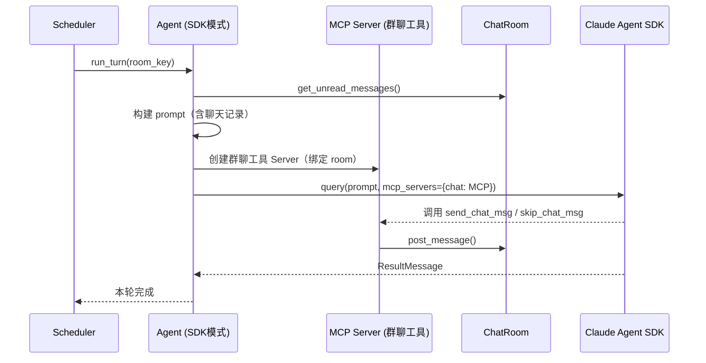

# V8: Agent 执行能力 - 技术文档

## 1. 架构概览

V8 引入 Claude Agent SDK 作为执行型 Agent 的驱动引擎。核心思路是在现有 `Agent.run_turn()` 流程内，根据 Agent 配置分流：普通 Agent 沿用当前的 LLM 调用路径，执行型 Agent 改用 Agent SDK 驱动，通过注入群聊专属工具（`send_chat_msg`、`skip_chat_msg`）与聊天室交互。

调度器、房间管理、消息总线均**无需改动**，改动范围集中在 `agent_service` 和 `func_tool_service`。

---

## 2. Agent SDK 驱动原理

### 2.1 工具注入机制

Agent SDK 通过 MCP Server 扩展自定义工具。`create_sdk_mcp_server` 在同一进程内启动 MCP Server，可通过闭包捕获 `ChatRoom` 引用，实现群聊工具与聊天室状态的绑定：

```python
@tool("send_chat_msg", "向聊天室发送消息", {"room_name": str, "content": str})
async def send_chat_msg(args):
    room.post_message(agent_name, args["content"])
    return {"content": [{"type": "text", "text": "ok"}]}

server = create_sdk_mcp_server("chat-tools", tools=[send_chat_msg, skip_chat_msg, ...])
```

执行型 Agent 可使用的工具分两类：
- **群聊工具**（每次 `run_turn` 动态创建，绑定当前房间）：`send_chat_msg`、`skip_chat_msg`
- **执行工具**（由 Agent 配置决定）：`Read`、`Write`、`Bash`、`WebSearch`、`WebFetch` 等

### 2.2 上下文传递

Agent SDK 的 `query()` 接收一个 prompt 字符串。`run_turn` 负责将聊天室上下文打包进 prompt：

```
你是 {agent_name}，正在参与 {room_name} 聊天室的对话。

最近的聊天记录：
{recent_messages}

你必须调用 send_chat_msg 发送消息，或调用 skip_chat_msg 跳过本轮发言。
```

### 2.3 发言完成判定

`query()` 返回后，检查 `ResultMessage` 即可判定本轮完成，无需像普通 Agent 那样在 `done_check` 中循环判断工具调用结果。

---

## 3. 核心模块改动

### 3.1 Agent 配置（`config/agents/<name>.json`）

新增两个可选字段：

```json
{
  "name": "researcher",
  "model": "claude-opus-4-6",
  "system_prompt": "你是一名研究员...",
  "use_agent_sdk": true,
  "allowed_tools": ["WebSearch", "WebFetch", "Read"]
}
```

| 字段 | 类型 | 说明 |
|------|------|------|
| `use_agent_sdk` | bool | 是否使用 Agent SDK 驱动，默认 `false` |
| `allowed_tools` | list | 允许使用的执行工具列表，仅 `use_agent_sdk=true` 时生效 |

### 3.2 Agent 实体类（`agent_service.py`）

`Agent` 类新增 `use_agent_sdk` 和 `allowed_tools` 属性。`run_turn` 根据 `use_agent_sdk` 分流：

```
run_turn()
  ├─ use_agent_sdk=False → 现有 chat() 流程（不变）
  └─ use_agent_sdk=True  → run_turn_sdk()
                              ├─ 构建 prompt（注入聊天室上下文）
                              ├─ 创建群聊 MCP Server（绑定当前 room）
                              └─ query(prompt, options=ClaudeAgentOptions(...))
```

新增 `run_turn_sdk()` 方法，封装 Agent SDK 调用逻辑，与现有 `run_turn` 并列。

### 3.3 依赖新增

```
claude-agent-sdk
```

加入 `requirements.txt`。Agent SDK 需要 Claude Code CLI 已安装（`simu_terminal_go` 所在环境通常已满足）。

---

## 4. 序列图



---

## 5. 兼容性说明

- 未设置 `use_agent_sdk` 的 Agent 行为与 V7 完全一致，零改动
- 普通 Agent 与执行型 Agent 可在同一聊天室共存，调度器轮次逻辑不受影响
- 执行型 Agent 的发言最终通过 `send_chat_msg` 写入 `ChatRoom`，消息格式与普通 Agent 相同，TUI 无需适配
