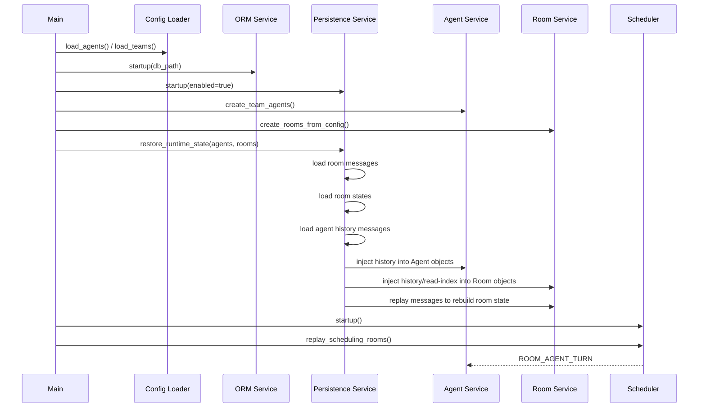

# V9: 数据持久化与重启恢复 - 技术文档

## 1. 架构概览

V9 的目标不是单纯“保存聊天记录”，而是让系统在服务重启后，能够基于上一次的运行状态继续调度、继续对话、继续协作。

当前系统的 Team、Agent、Room 主要由配置文件定义，但以下关键运行态仍只存在于内存中：

- `ChatRoom.messages`
- `ChatRoom._turn_index`：当前房间已经完成了多少整轮发言；所有成员完整走完一圈后加 1
- `ChatRoom._turn_pos`：当前轮次内轮到第几个成员发言，对应 `agents` 列表中的位置索引
- `ChatRoom._state`：房间当前调度状态，典型值为 `SCHEDULING` 或 `IDLE`
- `ChatRoom._round_skipped`：当前轮次里已经选择跳过发言的成员集合，用于判断是否“全员跳过”并停止调度
- `Agent._history`：Agent 私有上下文历史，包含同步到自身视角后的聊天内容，以及 tool call 相关消息
- `Agent.wait_task_queue`：Agent 待处理房间任务队列，队列中的每一项代表“去某个 room 执行一轮处理”

V9 将新增 `orm_service + DAL Manager + persistence_service` 三层持久化架构，把“运行时可变状态”从纯内存结构扩展为“内存态 + 本地持久层”双轨模型：

- **配置文件仍是静态定义源**：Team、Agent、Room 的初始定义仍来自 `config/`
- **SQLite 作为最小状态真源**：只保存不可轻易重建的历史消息和少量 Agent 私有上下文
- **内存对象作为执行态缓存**：启动时从配置和 SQLite 重建运行时对象，并通过历史重放恢复可推导状态
- **分层访问数据库**：`orm_service` 负责数据库基础设施，DAL Manager 负责查询/幂等写入规则，`persistence_service` 负责运行态恢复语义
- **写穿策略（write-through）**：每次关键状态变化，先经 DAL 落库，再更新内存并广播事件

V9 不追求跨版本兼容任意旧状态文件，优先保证单机、本地、单实例场景下的可靠恢复。

---

## 2. 核心设计原则

### 2.1 恢复的是“可继续运行的状态”

服务重启后，系统需要恢复的不只是消息列表，还包括：

- Agent 的私有 `_history`，以便保留跨房间感知与 tool call 上下文

其中房间的以下状态不再单独落盘，而是由历史消息重放后自动推导：

- 房间当前是否处于 `SCHEDULING`
- 当前轮到哪个 Agent 发言
- 已完成了多少轮
- 哪些成员在本轮中已经选择跳过

### 2.2 不直接持久化 asyncio 原语

`asyncio.Queue`、运行中的 `Task`、WebSocket 订阅等对象不可直接落盘。V9 采用“最小持久化 + 状态重建”而不是“对象序列化”：

- `wait_task_queue` 不直接持久化
- 服务启动时通过历史消息重放恢复房间内部状态
- 恢复完成后按重建出的房间状态重新发布 `ROOM_AGENT_TURN`
- 调度器重新驱动 Agent 消费任务

这意味着恢复的是“逻辑队列状态”，而不是 Python 对象本身。

### 2.3 配置与运行态分层

配置文件负责声明：

- 有哪些 Team
- 有哪些 Agent 定义
- 有哪些 Room
- 每个 Room 的成员、类型、最大轮次

SQLite 负责记录：

- 实际产生的消息
- 每个 Agent 的历史上下文

不直接保存轮次推进位置、发言位和跳过集合，这些都由历史消息和房间规则重建。

如果配置发生变化，以配置为准重建拓扑；持久层只恢复仍然合法的运行态。

### 2.4 基础设施与业务语义分层

参考 `dal_design_spec.md`，V9 的数据库访问分三层：

- **ORM Service 层**：负责数据库连接、建表、模型绑定、连接生命周期管理
- **DAL Manager 层**：负责按领域对象封装查询条件、幂等写入和更新逻辑
- **Persistence Service 层**：负责“运行态持久化”这一业务语义，对上为 `agent_service` / `room_service` 提供稳定接口

这意味着：

- `room_service`、`agent_service` 不直接写 SQL，也不直接操作 ORM 模型
- `persistence_service` 不负责数据库初始化和连接管理
- 复杂查询条件、幂等 upsert 规则集中沉淀在 Manager 层

### 2.5 先保证一致性，再考虑性能

V9 的写入量主要来自聊天消息和 Agent 历史消息，量级不大。优先选择事务清晰、恢复简单的设计：

- 单进程单实例写入
- 所有持久化写入串行经过 `persistence_service`
- 关键状态变更放入同一个事务提交

---

## 3. 持久化范围

### 3.1 Room 维度

V9 新增 `room_states` 表，每个 `room` 对应一条状态记录，房间运行态按独立字段存储。

Room 的以下信息仍由配置文件提供：

- `room_key`
- `name`
- `team_name`
- `room_type`
- `initial_topic`
- `members`
- `max_turns`

Room 的以下运行态由消息历史重放得到：

- `state`
- `turn_index`
- `turn_pos`
- `round_skipped`

Room 的以下运行态不适合仅靠历史消息可靠推导，建议写入 `room_states` 独立字段：

- `_agent_read_index`

### 3.2 消息维度

每条消息持久化以下字段：

- 自增 `id`
- `room_key`
- `team_name`
- `sender_name`
- `content`
- `send_time`

消息表是恢复房间上下文、重放房间调度状态和对外提供历史查询的基础。

### 3.3 Agent 维度

每个 Agent 只持久化以下最小运行态：

- `_history` 中的逐条消息记录

其中 `_history` 是 V9 的关键点。当前系统的跨房间感知和 tool call 流程依赖这份私有历史，若只恢复公开消息、不恢复 `_history`，则 Agent 重启后会“失忆”。

这里不再把整个 `_history` 序列化成单个 JSON 字段，而是按消息逐条存储，便于：

- 增量写入，避免每次覆盖整段历史
- 按顺序恢复 `_history`
- 排查具体是哪一条上下文消息导致行为变化

`agent_key`、`agent_name`、`team_name`、`use_agent_sdk` 均可由配置和启动时创建出的 Agent 实例推导得到，不再重复落盘。

---

## 4. 存储方案

### 4.1 存储选型

V9 采用 SQLite 作为默认运行态存储，原因如下：

- 单文件，部署简单
- 原生支持事务
- 查询消息历史与恢复状态都方便
- 比 JSON 快照更适合增量写入

保留导出 JSON 的能力作为调试或备份手段，但不作为主恢复链路。

### 4.2 建议目录结构

```text
runtime/
  state/
    teamagent.db
```

新增后端配置项：

```json
{
  "persistence": {
    "enabled": true,
    "db_path": "./runtime/state/teamagent.db"
  }
}
```

若未显式配置，则使用默认路径；若 `enabled=false`，则系统回退为当前纯内存模式。

### 4.3 建议数据表

```sql
CREATE TABLE room_messages (
  id INTEGER PRIMARY KEY AUTOINCREMENT,
  room_key TEXT NOT NULL,
  team_name TEXT NOT NULL,
  sender_name TEXT NOT NULL,
  content TEXT NOT NULL,
  send_time TEXT NOT NULL
);

CREATE INDEX idx_room_messages_room_key_id
ON room_messages(room_key, id);

CREATE TABLE room_states (
  room_key TEXT PRIMARY KEY,
  agent_read_index_json TEXT NOT NULL,
  updated_at TEXT NOT NULL
);

CREATE TABLE agent_history_messages (
  id INTEGER PRIMARY KEY AUTOINCREMENT,
  agent_key TEXT NOT NULL,
  seq INTEGER NOT NULL,
  message_json TEXT NOT NULL,
  updated_at TEXT NOT NULL
);

CREATE UNIQUE INDEX idx_agent_history_agent_seq
ON agent_history_messages(agent_key, seq);
```

说明：

- `agent_read_index_json` 用于保存 `room -> {agent_name: last_read_msg_pos}` 的映射，格式为 JSON 对象
- `message_json` 直接保存单条历史消息的完整内容，格式与现有 LLM message 结构保持一致
- `seq` 表示该消息在同一 `agent_key` 私有历史中的顺序，用于恢复时按原顺序重建 `_history`

### 4.4 推荐目录结构

参考 DAL 设计规范，V9 建议采用如下目录组织：

```text
src/
  model/
    db_model/
      base.py
      room_message.py
      room_state.py
      agent_history_message.py
  dal/
    db/
      room_message_manager.py
      room_state_manager.py
      agent_history_manager.py
  service/
    orm_service.py
    persistence_service.py
```

职责划分：

- `model/db_model/`：定义 ORM 模型、通用字段、轻量模型能力
- `dal/db/`：定义按领域划分的 Manager，封装查询条件、幂等 upsert、批量恢复读取
- `service/orm_service.py`：负责数据库连接、建表、自动重连策略、模型绑定
- `service/persistence_service.py`：负责最小持久化、恢复编排、对外稳定接口

---

## 5. 核心模块改动

### 5.1 新增 ORM 服务 (`src/service/orm_service.py`)

参考 DAL 设计规范，`orm_service` 只负责数据库基础设施，不承载业务语义。

职责：

- 从配置读取 `db_path`
- 初始化 SQLite 连接
- 配置连接生命周期与基础重试策略
- 绑定 ORM 模型
- 启动时检查并创建缺失表
- 停止时优雅关闭连接

建议接口：

```python
async def startup(db_path: str) -> None
async def shutdown() -> None

def get_db()
def is_ready() -> bool
```

这里的重点是分层边界：

- `orm_service` 不提供 `save_room()`、`append_message()` 这类领域方法
- 它只提供数据库和模型可用性

### 5.2 新增持久化服务 (`src/service/persistence_service.py`)

`persistence_service` 位于 `orm_service` 之上，负责“运行态持久化”这一业务语义。

职责：

- 编排消息和 Agent 历史的持久化
- 对 `room_service` / `agent_service` 提供稳定接口
- 将恢复逻辑集中管理
- 调用 DAL Manager，而不是直接操作底层连接

建议接口：

```python
async def startup(enabled: bool) -> None
async def shutdown() -> None

def is_enabled() -> bool

def append_room_message(room_key: str, team_name: str, sender: str, content: str, send_time: str) -> int
def save_room_state(room_key: str, agent_read_index: dict[str, int]) -> None
def append_agent_history_messages(agent_key: str, messages: list[dict]) -> None

def load_room_messages(room_key: str) -> list[dict]
def load_room_state(room_key: str) -> dict | None
def load_agent_history(agent_key: str) -> list[dict]
def restore_runtime_state(agents: list[Agent], rooms: list[ChatRoom]) -> None
```

`persistence_service` 不直接拼接查询条件，也不直接承载 SQL 方言细节，这些职责应下沉到 Manager 层。

### 5.3 DAL Manager 层 (`src/dal/db/*.py`)

V9 需要按领域对象提供 Manager，负责查询条件构造和幂等写入逻辑。

建议拆分：

- `room_message_manager.py`
- `room_state_manager.py`
- `agent_history_manager.py`

典型职责：

- `append_room_message(message)`
- `get_room_messages(room_key, after_id=None)`
- `upsert_room_state(room_key, agent_read_index_json)`
- `get_room_state(room_key)`
- `append_agent_history_messages(agent_key, messages)`
- `get_agent_history(agent_key)`

设计要求：

- 复杂查询条件集中在内部 `_build_xxx_condition()`
- 幂等写入逻辑放在 `sync_xxx_to_db()` 或 `upsert_xxx()` 中
- `persistence_service` 通过稳定方法调用 Manager，而不是自行决定“先查还是先写”

### 5.4 启动流程 (`src/main.py`)

现有启动流程：

1. 加载配置
2. 启动各 service
3. 创建 Agent
4. 创建 Room
5. 启动 Scheduler

V9 调整为：

1. 加载配置
2. 启动 `message_bus`
3. 启动 `orm_service`
4. 启动 `persistence_service`
5. 启动 `agent_service` / `room_service`
6. 根据配置创建运行时对象骨架，但此时不触发任何房间调度事件
7. `main` 调用 `persistence_service`，由其检查并恢复各 Agent / Room 的历史状态
8. `persistence_service` 将恢复得到的数据注入到对应对象，并驱动房间完成历史消息重放
9. 启动 `scheduler`
10. 统一调用显式调度入口，为所有重建后 `state=SCHEDULING` 的房间发布当前轮次事件

这样可以保证调度器接手之前，内存态已经是“通过历史重放恢复完成”的状态。

### 5.5 房间服务 (`src/service/room_service.py`)

`room_service` 不再负责“检查数据库并恢复房间状态”的编排逻辑，只负责创建对象和提供状态注入入口。

建议新增：

- `inject_history_messages(...)`
- `inject_agent_read_index(...)`
- `rebuild_state_from_history(...)`
- `start_scheduling()`

关键改动点：

#### `create_room`

职责从“创建房间后立即进入调度”改为“只创建，不自动启动调度”：

- 先按配置创建房间骨架
- 若是首次启动，则写入初始系统消息
- 若后续需要恢复历史状态，由 `persistence_service` 单独处理
- `create_room` 本身不发布 `ROOM_AGENT_TURN`

这样做的原因是：恢复阶段需要先把消息历史和房间运行态恢复到位；如果刚创建对象就自动发起调度，会导致 Agent 在状态未恢复完成时提前开始执行。同时，创建行为和恢复行为拆开后，`room_service` 的职责也更单一。

#### `inject_history_messages` / `inject_agent_read_index` / `rebuild_state_from_history`

由 `persistence_service` 在恢复阶段调用：

- `inject_history_messages(...)`：把已经从数据库读出的消息列表注入 `ChatRoom.messages`
- `inject_agent_read_index(...)`：把已经从数据库读出的 `_agent_read_index` 注入 `ChatRoom`
- `rebuild_state_from_history(...)`：基于已注入的历史消息，在不重复落盘、不重复广播的前提下重建 `ChatRoom` 的轮次状态

也就是说：

- `room_service` 只提供对象层面的状态注入能力
- `persistence_service` 负责决定“是否恢复、恢复哪些房间、按什么顺序恢复”

#### `start_scheduling`

新增显式调度入口，由调用方在合适时机触发：

- 若房间当前应进入 `SCHEDULING`，则发布一次当前轮次事件
- 若房间已是 `IDLE`，则不做任何操作
- 该方法既可用于首次启动，也可用于恢复完成后的统一调度启动

V9 中，推荐由 `main.py` 或 `scheduler_service.replay_scheduling_rooms()` 在“所有房间恢复完成之后”统一调用，而不是在 `create_room` 内部隐式触发。

#### `add_message`

当前逻辑是直接写入 `self.messages` 然后广播。V9 改为：

1. `persistence_service` 调用 `room_message_manager` 持久化消息到 `room_messages`
2. 写入内存 `self.messages`
3. 广播 `ROOM_MSG_ADDED`
4. 更新房间轮次状态
5. 不再单独持久化房间轮次状态

这样即使在广播后异常退出，也不会丢消息主记录；房间轮次可在下次启动时由消息历史重放恢复。

#### `get_unread_messages`

当前依赖 `_agent_read_index` 的内存下标。V9 继续保留该内存机制，但不再单独落盘。
这里调整为：

- `_agent_read_index` 写入 `room_states.agent_read_index_json`
- 恢复时由 `persistence_service` 读取并注入到对应 `ChatRoom`

这样可以避免重启后把旧消息再次作为“未读消息”重复投递给 Agent，也避免仅靠历史消息做不可靠推断。

### 5.6 Agent 服务 (`src/service/agent_service.py`)

`agent_service` 不负责“检查数据库并恢复 Agent 状态”的编排逻辑，只负责提供 `_history` 的状态注入能力。

建议新增：

```python
def dump_history_messages(self) -> list[dict]
def inject_history_messages(self, items: list[dict]) -> None
```

持久化时机：

- `sync_room()` 后若 `_history` 新增消息，增量落盘
- 普通 LLM 模式下一次 `chat()` 完成后，将新增消息增量落盘
- SDK 模式下 `_sdk_do_send()` 或 `_run_turn_sdk()` 消费完一轮后，将新增消息增量落盘

注意：

- **持久化的是上下文数据，不是 SDK 连接本身**
- `self._sdk_client` 不可恢复，服务重启后重新 `init_sdk()`
- 但 `_history` 恢复后，Agent 仍保有先前上下文

推荐由 `persistence_service` 调用 `agent_history_manager` 完成 `_history` 的顺序读取，再把结果注入到对应 Agent 对象。

### 5.7 调度服务 (`src/service/scheduler_service.py`)

调度器不保存 asyncio task，但要支持恢复调度入口。

建议新增：

```python
def replay_scheduling_rooms() -> None
```

逻辑：

- 遍历所有房间
- 对 `room.state == SCHEDULING` 的房间，调用 `room.start_scheduling()`

这里的 `room.state` 和当前发言人不是从数据库字段直接读出，而是由历史消息重放后的 `ChatRoom` 内存状态给出。调度器不再依赖 `create_room` 时的隐式首发事件，而是统一通过显式入口恢复调度。

这样就能重建服务重启前“本应继续执行”的调度位置。

---

## 6. 恢复流程设计

### 6.1 启动恢复顺序



### 6.2 首次启动与恢复启动的判定

- 若数据库不存在，视为首次启动
- 若数据库存在但无对应 `room_key` 消息数据，视为该房间首次创建
- 若数据库存在且有历史消息，视为恢复启动

首次启动时仍写入系统建房公告；恢复启动时不重复注入这条系统消息。

无论是首次启动还是恢复启动，都遵循同一原则：

- `create_room` 只负责创建对象和装载数据
- `create_team_agents` 只负责创建 Agent 对象
- `persistence_service` 负责检查数据库中是否存在对应历史状态
- `persistence_service` 负责把历史状态注入到 Agent / Room 对象
- 房间是否开始调度，由后续显式调用 `start_scheduling()` 决定

### 6.3 异常退出后的恢复行为

若进程异常退出，重启后按以下规则恢复：

- 已成功提交到 SQLite 的消息全部保留
- 已成功提交的 Room 读取进度状态全部保留
- 已成功提交的 Agent 历史消息全部保留
- 未提交到 SQLite 的瞬时内存状态丢失
- 调度器根据“历史消息重放后”得到的房间状态重新开始

因此，V9 的一致性边界是“SQLite 最后成功提交的房间消息、Room 读取进度状态与 Agent 历史消息”。

---

## 7. 一致性与事务策略

### 7.1 消息写入事务

对 `ChatRoom.add_message()`，建议采用单事务处理：

1. `room_message_manager` 插入 `room_messages`
2. 如有需要，同时由 `room_state_manager` 更新 `agent_read_index_json`
3. 提交事务

事务提交后再进行消息总线广播。

### 7.2 Agent 历史事务

`Agent._history` 可以独立持久化，不必与消息写入放入同一个事务。这里的持久化单位是“单条历史消息”而不是整段快照。原因：

- 房间消息是共享真相，也是房间状态重建的依据，优先级最高
- Agent 私有历史是派生运行态
- 即使 `_history` 落后一次，也可在下一轮通过房间消息补齐大部分上下文

因此 V9 允许：

- 房间消息强一致
- Room 读取进度状态与房间消息尽量同事务提交
- Agent 私有历史最终一致

---

## 8. 兼容性与边界

### 8.1 对现有功能的兼容

- 未启用持久化时，行为与 V8 保持一致
- Web API 与 TUI 的读接口无需大改，只是底层数据从“纯内存”变为“内存 + 持久层恢复”
- 普通 Agent 与 SDK Agent 都支持恢复

### 8.2 V9 不处理的内容

V9 暂不覆盖以下场景：

- 多进程同时写同一份运行数据库
- 分布式部署
- 跨机器共享状态
- Claude SDK 内部会话句柄级别的恢复
- 历史 schema 自动迁移多版本兼容

这些能力可留到后续版本演进。

---

## 9. 测试建议

### 9.1 单元测试

- `orm_service` 建表、连接初始化、关闭流程
- `persistence_service` 插入、查询、恢复编排
- `ChatRoom.add_message()` 后消息是否正确落盘
- 历史消息重放后，`ChatRoom` 是否能恢复正确的轮次状态
- `Agent.dump_history_messages()/load_history_messages()` 的往返一致性

### 9.2 集成测试

- 启动服务，完成若干轮对话，关闭后再次启动，验证消息连续
- 在房间处于 `SCHEDULING` 中途重启，验证重启后通过历史重放从正确 Agent 继续
- 验证某 Agent 的跨房间上下文在恢复后仍可引用旧内容
- 验证 `enabled=false` 时系统仍按旧模式运行

### 9.3 故障测试

- 在 `add_message()` 后、广播前模拟异常退出，验证消息不丢
- 在轮次推进中途异常退出，验证恢复后可由历史重放回到正确轮次
- 模拟数据库文件损坏，验证系统明确报错而不是静默以空状态启动

---

## 10. 实施顺序建议

建议按以下顺序落地 V9：

1. 新增 `orm_service`，先打通数据库初始化、模型绑定和基础表结构
2. 新增 `model/db_model` 与 `dal/db/*_manager.py`
3. 新增 `persistence_service`，封装运行态恢复与保存接口
4. 为 `room_service` 增加消息持久化与历史重放恢复
5. 为 `agent_service` 增加 `_history` 的逐条导出与恢复
6. 改造 `main.py` 启动流程，加入 `orm_service` 和恢复阶段
7. 为 `scheduler_service` 增加 `replay_scheduling_rooms()`
8. 补充单元测试和“重启恢复”集成测试

这个顺序能先确保“消息不丢”，再通过历史重放逐步补齐“继续运行”的完整能力。
